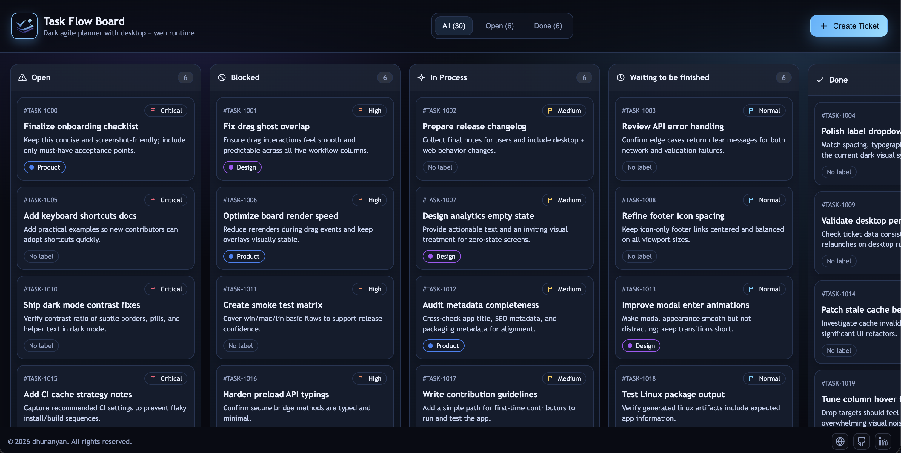

  <h1>Task Flow Board</h1>
  

  
<strong>Production-ready draggable Kanban board for Web and Desktop.</strong>

  

    
    
    
    
    
  

## Overview

  

Task Flow Board is a dark-first task management app built with **Next.js App Router + Electron**.

- Drag-and-drop Kanban workflow
- Desktop + Web runtime
- Local persistence for both platforms
- Clean, keyboard-friendly UI

## Environment Variables

| Variable   | Required | Values              | Default | Description                                   |
| ---------- | -------- | ------------------- | ------- | --------------------------------------------- |
| `PLATFORM` | Yes      | `WEB`, `DESKTOP`    | `WEB`   | Runtime abstraction used by app/build scripts |
| `TARGET`   | Yes      | `WIN`, `MAC`, `LIN` | `MAC`   | Desktop target abstraction                    |

## Scripts

| Command                  | Purpose                                    |
| ------------------------ | ------------------------------------------ |
| `yarn dev:web`           | Run Next.js in development mode            |
| `yarn dev:desktop`       | Run Electron + Next.js in development mode |
| `yarn build:web`         | Production static web build                |
| `yarn build:desktop:mac` | Production desktop build for macOS         |
| `yarn build:desktop:win` | Production desktop build for Windows       |
| `yarn build:desktop:lin` | Production desktop build for Linux         |

## Production Output

| Artifact Type                | Location   |
| ---------------------------- | ---------- |
| Web static export            | `out/`     |
| Desktop installers / bundles | `release/` |

## Core Features

- 5 status columns: Open, Blocked, In Process, Waiting to be finished, Done
- Ticket details modal with edit/delete
- Priority levels (5)
- Custom labels with color picker
- Bulk delete for Done column (with confirmation)

## Data Persistence

| Platform | Storage                                               |
| -------- | ----------------------------------------------------- |
| Web      | Browser `localStorage`                                |
| Desktop  | Electron user-data file: `public-assets/tickets.json` |

## Tech Stack

- Next.js (App Router)
- React + TypeScript
- Electron + electron-builder
- dnd-kit

## License

MIT — see [LICENSE](./LICENSE).
